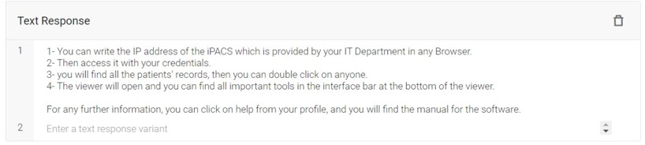
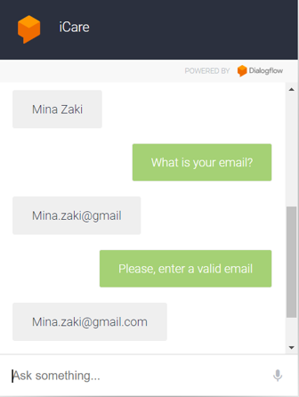

# iCare-ChatBot
You can try iCare ChatBot through this [Link](https://bot.dialogflow.com/a1d7bee4-5cc3-48c1-a215-5ffaae984bae)
# Table of Content:
1. [Chatbot ٍSubject](#p1)
2. [Ontology](#p2)
3. [Competency Questions](#p3)
4. [Test Cases](#p4)
5. [Training](#p5)
6. [Evaluation](#p6)

# <a name="p1">Chatbot Subject</a>
iCare is chatbot, for a software solutions company. This company offers software solutions for healthcare facilities, and consists of 4 main components (customer-department-employee-products), and it offers 2 main software solution for healthcare facilities (iPACS – iRIS). 
The chatbot can help the customer main to: 
-	File a complaint against definite employee in technical support department or sales department.
-	Report a technical issue in definite product.
-	Ask about our products, or about a definite product.
-	Ask for contacting one of the technical support representatives.

# <a name="p2">Ontology</a>

As we said, iCare consists of 4 classes and each class consists of different attributes and it goes as follow:
-	Customer: Name, Email, Location, region, Facility name.
-	Employee: Name, Email, deptID.
-	Department: DeptID, Department name.
-	Products: product name.

**Class diagram:**

**Data Properties Diagram:**

**Object Attributes Diagram:**

**Individuals Diagram:**

**Ontology Graph:**

# <a name="p3">Competency Questions</a>
We put a question for each case:
1.	File a complaint against definite employee in technical support department or sales department.
question: I need to make a complaint?

2.	Report a technical issue in integration.
question: How to solve the problem of integration?

3.	Report a technical issue in images.
question: How to solve the problem of not receiving images?

4.	Report a technical issue in diagnostic tool.
 question: How to diagnose patient exam?

5.	Ask about our products, or about a definite product.
question: what are the features of your system?

6.	Ask for contacting one of sales representatives.
question: How to reach sales team? 

# <a name="p4">Test Cases</a>
After getting the competency questions, we get alternative ways to ask these questions. 

**1.	Report a technical issue in integration**
   - I have an integration issue
   - The connection between Broker and PACS is stopped
   - The appointment cannot be shown on the software
   - The HIS messages can't reach the system.
   - The broker is stopped
   - How to Solve the Problem of integration?

**2.	Report a technical issue in images.**
   - How to solve the issue of not receiving images?
   - Doctors can't see the exams on iPACS.
   - The connection between the Modality and PACS is stopped.
   - Modalities can't send to PACS
   - PACS stopped working.
   - PACS is down.

**3.	Report a technical issue in diagnostic tool**
   - How to diagnose patient exams?
   - How to use the software?
   - From where I can open the exam?
   - How to find the diagnostic tools?
   - How to open iPACS?
   - What are the instructions for diagnosis?

**4.	Ask about our products, or about a definite product**
   - What are the features of the system?
   - How is the software important?
   - What are the uses of your products?
   - I want to know more info about your products.
   - How can your products be useful?
   - What are your products?

**5.	Ask for contacting one of sales representatives**
   - Is there any email for the sales department?
   - How to reach the sales team contact?
   - Send me the sales contacts.
   - I need to contact sales Department.
   - Email of the sales department.

**6.	File a complaint against definite employee in technical support department or sales department**
   - I am upset from the service
   - I want to file a complaint
   - I want to make a complaint
   - Complain to someone
   - I have a complaint

# <a name="p5">Training</a>
Training phrases examples:

Text response examples:

# <a name="p6">Evaluation</a> 

| Sample 1                     | Sample 2                     |
|------------------------------|------------------------------|
|  |  |

| Sample 3                     | Sample 4                     |
|------------------------------|------------------------------|
|  |  |

| Sample 5                      | Sample 6                      |
|-------------------------------|-------------------------------|
|  |  |

| Sample 7                      | Sample 8                      |
|-------------------------------|-------------------------------|
|  |  |
